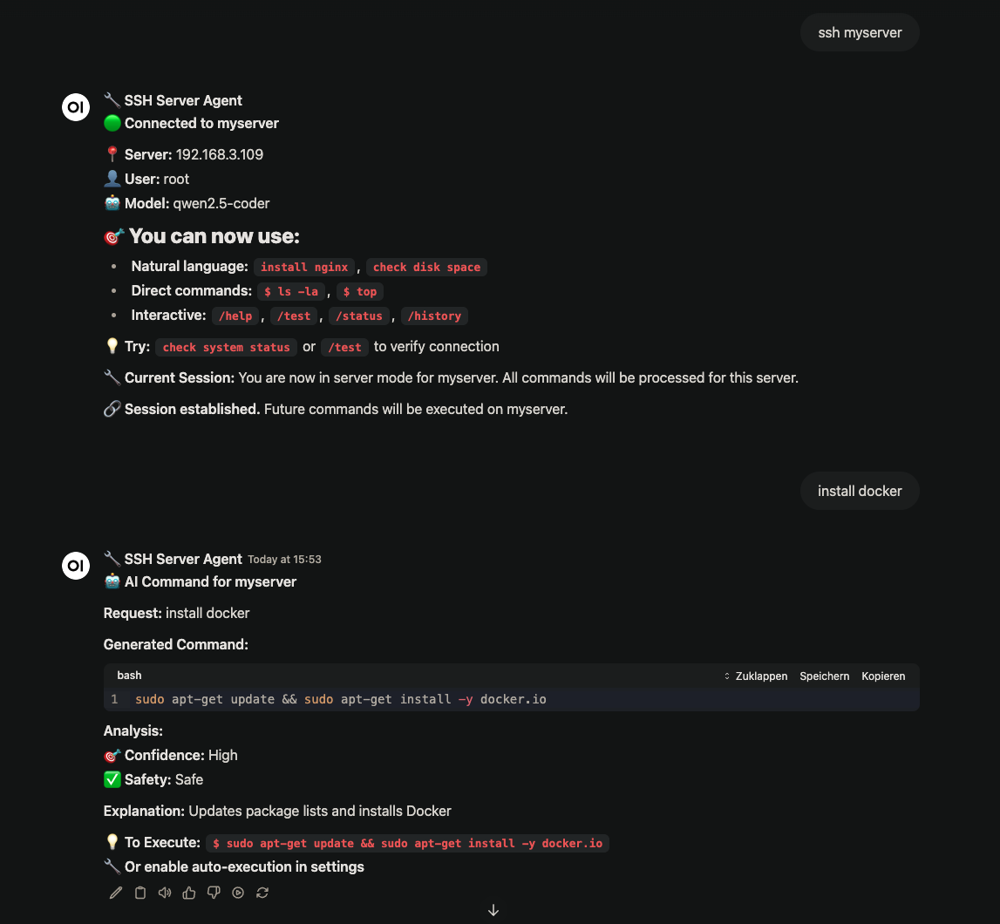

# 🔧 SSH Server Agent

> AI-powered SSH server management with interactive sessions for Open WebUI

[](https://python.org)
[](LICENSE)
[](https://github.com/open-webui/open-webui)

Transform your server management experience with natural language commands, AI-powered assistance, and seamless SSH integration. Execute complex server tasks by simply asking it!!



## ✨ Features

### 🤖 **AI-Powered Commands**
- **Natural Language Processing**: "install nginx", "check disk space", "update system"
- **Smart Command Generation**: AI analyzes your request and generates safe, appropriate commands
- **Auto-sudo Detection**: Automatically determines when commands need elevated privileges
- **Safety Validation**: Built-in protection against dangerous operations

### 🔌 **Multi-Server Management**
- **Easy Configuration**: JSON-based server setup in Valves settings
- **Multiple Connections**: Manage multiple servers simultaneously
- **Session Persistence**: Maintain active SSH connections across conversations
- **Quick Connect**: `ssh production` or `connect webserver` - it's that simple!

### ⌨️ **Interactive Terminal Support**
- **Real-time Interaction**: Handle prompts, confirmations, and user input
- **Smart Detection**: Automatically detects when commands need interactive input
- **Simple Response**: Just use `!your_response` to continue interactive sessions
- **Progress Monitoring**: See real-time output from long-running commands

### 🛡️ **Safety**
- **Command Validation**: AI validates commands before execution
- **Dangerous Command Protection**: Blocks potentially harmful operations
- **Confidence Scoring**: AI rates command safety and reliability

## 🚀 Quick Start

### Prerequisites

- **Open WebUI** installed and running
- **Server Access**: SSH access to your target servers
- **User Permissions**: User account with sudo privileges or specific command permissions

> ⚠️ **Critical Security Warning**: Passwords are stored in **plain text** in the JSON configuration. This pipe is **NOT recommended for production or critical environments**. Use only in trusted, isolated development environments until a secure credential storage solution is implemented.

> ℹ️ **Important**: The SSH user needs sudo privileges for system administration tasks like package installation, service management, and system configuration. For security, consider using a dedicated user with limited sudo access via `/etc/sudoers.d/` configuration.

### How-To

1. **Install the tool** https://openwebui.com/f/teodorgross/ssh_server_agent
2. **Configure Servers** (see Configuration section below)
3. **Start Managing!**
   - Start a new chat and select "🔧 SSH Server Manager" as the model
   - Type `list servers` to see your configured servers
   - Connect with `ssh production` or similar

## ⚙️ Configuration

### Server Setup via Valves

Configure your servers directly in the Valves settings:

1. Open the function settings (click the gear icon)
2. Edit the **SERVERS** field
3. Add your servers in JSON format:

```json
[
    {
        "name": "testserver",
        "host": "192.168.1.100",
        "username": "admin",
        "password": "secure_password_here",
        "model": "llama3.2",
        "port": 22,
        "os": "ubuntu 24"
    },
    {
        "name": "testserver2",
        "host": "web.example.com",
        "username": "webadmin",
        "password": "web_password_here",
        "model": "gemma2",
        "port": 2222,
        "os": "ubuntu 24"
    },
    {
        "name": "development",
        "host": "dev.company.com",
        "username": "developer",
        "password": "dev_password_here",
        "model": "llama3.1",
        "port": 22,
        "os": "ubuntu 24"
    }
]
```

### Valve Settings

| Setting | Default | Description |
|---------|---------|-------------|
| `OLLAMA_BASE_URL` | `http://localhost:11434/api/chat` | Ollama API endpoint |
| `SSH_TIMEOUT` | `15` | SSH connection timeout (seconds) |
| `AUTO_EXECUTE_HIGH_CONFIDENCE` | `false` | Auto-run safe, high-confidence AI commands |
| `SERVERS` | `[]` | JSON array of server configurations |

### User Permissions Setup

For optimal functionality, your SSH user should have appropriate permissions:

#### Option 1: Full sudo access (simplest)
```bash
# Add user to sudo group
sudo usermod -aG sudo your-ssh-user
```

#### Option 2: Limited sudo access (recommended)
Create a sudoers file for specific commands:

```bash
# Create /etc/sudoers.d/ssh-agent-user
your-ssh-user ALL=(ALL) NOPASSWD: /usr/bin/apt, /usr/bin/yum, /bin/systemctl, /usr/bin/docker, /bin/mount, /bin/umount
```

#### Option 3: Service-specific permissions
For web servers, databases, etc.:
```bash
# Example for web server management
your-ssh-user ALL=(ALL) NOPASSWD: /bin/systemctl restart nginx, /bin/systemctl reload nginx, /bin/systemctl status nginx
```

## 📖 Usage Guide

### Connection Methods

#### 1. Direct Connection
```bash
ssh production          # Connect to production server
connect webserver       # Alternative syntax
```

#### 2. Model Selection
Start a new chat and select your server model: **🖥️ production (admin@192.168.1.100)**

### Command Types

#### 🤖 Natural Language (AI-Powered)
```bash
install docker and start the service
check disk space and memory usage
update all system packages
show me running processes using high CPU
find large files in /var/log
```

#### 💻 Direct Commands
```bash
$ ls -la /home              # Direct command execution
$ top                       # Real-time process monitor
$ df -h                     # Disk usage
/sudo systemctl restart nginx   # Explicit sudo command
```

#### 🎯 Interactive Commands
```bash
$ sudo apt install nginx
# When prompted: Do you want to continue? [Y/n]
!y

$ nano config.txt
# When nano opens for editing
!This is my configuration content
```

### Slash Commands

| Command | Description |
|---------|-------------|
| `/help` | Show all available commands |
| `/status` | Connection and server status |
| `/test` | Test SSH connection |
| `/history [n]` | Show last n commands (default: 10) |
| `/info` | Detailed server information |
| `/disconnect` | End session and return to manager |

### Interactive Input

When a command requires user input, you'll see:
```
⌨️ Interactive Input Required
Hint: Expecting yes/no answer (y/n)

How to respond: !your_response
```

Simply respond with:
- `!yes` - for confirmations
- `!1` - for menu selections
- `!mypassword` - for password prompts
- `!/path/to/file` - for file paths

## 🔧 Advanced Features

### AI Command Generation

The AI analyzes your requests and generates appropriate commands:

```
Request: "install nginx and configure it to start on boot"

Generated Command: sudo apt update && apt install -y nginx && systemctl enable nginx

Analysis:
🎯 Confidence: High
✅ Safety: Safe  
🔐 Requires: sudo privileges
Explanation: Updates package list, installs nginx web server, and enables auto-start
```

### Multi-Server Workflows

Manage multiple servers in parallel:

```bash
# Terminal 1: Production server
ssh production
install security updates

# Terminal 2: Development server  
ssh development
deploy latest application version

# Terminal 3: Database server
ssh database
backup all databases
```

### Command History & Auditing

Track all executed commands:
```bash
/history 20    # Show last 20 commands
```

Each entry shows:
- 🤖 AI-generated or 💻 Direct command
- ✅ Success or ❌ Failure status
- 📅 Execution timestamp

## Security Considerations

### ⚠️ Critical Security Warning

**This pipe stores passwords in plain text within the JSON configuration.** This presents significant security risks:

- **Passwords are visible** in the Valves settings interface
- **No encryption** is applied to stored credentials
- **Configuration backups** contain plain text passwords
- **Admin access** to Open WebUI means access to all server credentials

### 🚨 Not Recommended For:
- **Production environments**
- **Critical infrastructure**
- **Servers with sensitive data**
- **Multi-user Open WebUI installations**
- **Any environment requiring security compliance**

### ✅ Acceptable Use Cases:
- **Personal development servers**
- **Isolated lab environments**
- **Non-critical testing systems**
- **Temporary demonstration setups**


## 🔍 Troubleshooting

### Common Issues

#### Connection Failed
```
❌ Connection failed: Authentication failed
```
**Solution**: Check username/password in Valves configuration

#### SSH Timeout
```
❌ Connection error: timeout
```
**Solutions**:
- Increase `SSH_TIMEOUT` in Valves
- Check network connectivity
- Verify SSH service is running on target server

#### Permission Denied
```
❌ sudo: command not found or permission denied
```
**Solutions**:
- Verify user has sudo privileges
- Check `/etc/sudoers` configuration
- Try direct command: `$ whoami` to verify connection

#### Interactive Commands Stuck
```
⌨️ Interactive Input Required (not responding)
```
**Solutions**:
- Use `/disconnect` and reconnect
- Try direct command: `$ killall command_name`
- Check if command is waiting for specific input format


## 📄 License

This project is licensed under the MIT License - see the [LICENSE](LICENSE) file for details.

## 🙏 Acknowledgments

- **Open WebUI Team** - For the amazing platform
- **Paramiko Contributors** - For SSH connectivity
- **Ollama Team** - For local AI capabilities
- **Community** - For feedback and feature requests

## 💖 Support

If you find this project helpful:

- ⭐ Star the repository
- 🐛 Report bugs and issues
- 💝 [Support the developer](https://ko-fi.com/teodorgross)
---

**Made with ❤️ by [Teodor Gross](https://github.com/teodorgross)**
